# Awesome-3D-Detection-with-4D-Radar

【If you want to add anything to this repository, please create a PR or email to i@cvzoo.cn】

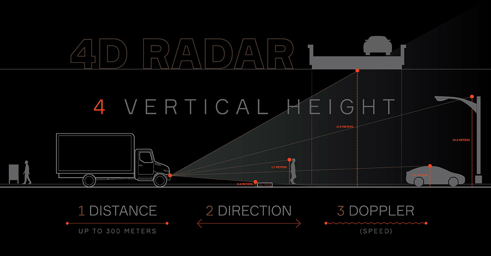

## Overview

- [Datasets](#Datasets)
- [SOTA Papers](#SOTA-Papers)
  - [From 4D Radar  (Point Cloud&Radar Tensor)](#From-4D-Radar-(Point-Cloud&Radar-Tensor))
  - [Fusion of 4D Radar & LiDAR](#Fusion-of-4D-Radar-&-LiDAR)
  - [Fusion of 4D Radar & RGB Camera](#Fusion-of-4D-Radar-&-RGB-Camera)
  - [Others](#Others)
- [Survey Papers](#Survey-Papers)
- [Basic Knowledge](#Basic-Knowledge)
- [Representative researchers](#Representative-researchers)

## Datasets

|      Dataset       |                           Sensors                            | Radar Data  |   Source   |      Annotations      |                             Url                             |                            Other                             |
| :----------------: | :----------------------------------------------------------: | :---------: | :--------: | :-------------------: | :----------------------------------------------------------: | :----------------------------------------------------------: |
|       Astyx        |                    4D Radar,LiDAR, Camera                    |     PC      |  19'EuRAD  |        3D bbox        | [github](https://github.com/under-the-radar/radar_dataset_astyx/)  [paper](https://ieeexplore.ieee.org/abstract/document/8904734) |                         ~500 frames                          |
|       RADIal       |                    4D Radar,LiDAR, Camera                    | PC, ADC, RT |  22'CVPR   |     2D bbox, seg      | [github](https://github.com/valeoai/RADIal)  [paper](https://openaccess.thecvf.com/content/CVPR2022/papers/Rebut_Raw_High-Definition_Radar_for_Multi-Task_Learning_CVPR_2022_paper.pdf) |                     8,252 labeled frames                     |
| View-of-Delft(VoD) |                4D Radar,LiDAR, Stereo Camera                 |     PC      |  22'RA-L   |        3D bbox        | [website](https://tudelft-iv.github.io/view-of-delft-dataset/) |                         8,693 frames                         |
|     TJ4DRadSet     |                 4D Radar,LiDAR, Camera, GNSS                 |     PC      |  22'ITSC   |   3D bbox, TrackID    | [github](https://github.com/TJRadarLab/TJ4DRadSet)  [paper](https://ieeexplore.ieee.org/abstract/document/9922539) |                         7,757 frames                         |
|      K-Radar       |            4D Radar,LiDAR, Stereo Camera, RTK-GPS            |     RT      | 22'NeurIPS |   3D bbox, TrackID    | [github](https://github.com/kaist-avelab/k-radar)  [paper](https://arxiv.org/pdf/2206.08171) |                   35K frames; 360° Camera                    |
|     Dual Radar     |                 dual 4D Radars,LiDAR, Camera                 |     PC      |  25'Scientific Data  |   3D bbox, TrackID    | [github](https://github.com/adept-thu/Dual-Radar)  [paper](https://arxiv.org/pdf/2310.07602)           |                          10K frames                          |
|      L-RadSet      |                  4D Radar,LiDAR, 3 Cameras                   |     PC      |   24'TIV   |   3D bbox, TrackID    | [github](https://github.com/crrasjtu/L-RadSet)  [paper](https://ieeexplore.ieee.org/abstract/document/10591452) |              11.2K frames; Annos range to 220m               |
|      ZJUODset      |                    4D Radar,LiDAR, Camera                    |     PC      | 23'ICVISP  |   3D bbox, 2D bbox    | [github](https://github.com/Ruoyu-Xu/ZJUODset) [paper](https://ieeexplore.ieee.org/abstract/document/10401068) |    19,000 frames of raw data and 3,800 annotated frames.     |
|        CMD         | 32-beam LiDAR, 128-beam LiDAR, solid-state LiDAR, 4D Radar, 3 Cameras |     PC      |  24'ECCV   |        3D bbox        | [github](https://github.com/im-djh/CMD) [paper](https://www.ecva.net/papers/eccv_2024/papers_ECCV/papers/07443.pdf) | 50 high-quality sequences, each spanning 20 seconds, equating to 200 frames per sensor |
|       V2X-R        |              4D Radar,LiDAR, Camera (simulated)              |     PC      |  24'arXiv  |        3D bbox        | [github](https://github.com/ylwhxht/V2X-R) [paper](https://arxiv.org/pdf/2411.08402) | V2X-R contains 12,079 scenarios with 37,727 frames of LiDAR and 4D radar point clouds, 150,908 images |
|   OmniHD-Scenes    |              6 4D Radars, LiDAR, 6 Cameras, IMU              |     PC      |  24'arXiv  | 3D bbox, TrackID, OCC | [website](https://www.2077ai.com/OmniHD-Scenes) [paper](https://arxiv.org/pdf/2412.10734) |         totaling more than 450K synchronized frames          |
|  MAN TruckScenes   |        6 4D Radars, 4 Cameras, 6 LiDAR, 1 GNSS, 2 IMU        |     PC      |  24'arXiv  |            3D bbox           | [paper](https://arxiv.org/pdf/2407.07462v2) | Bounding boxes are available for 27 object classes, 15 attributes, and a range of more than 230 m. |

## SOTA Papers

### From 4D Radar (Point Cloud&Radar Tensor)

1. **RPFA-Net: a 4D RaDAR Pillar Feature Attention Network for 3D Object Detection (21'ITSC)**
   - **:link:Link:** [paper](https://ieeexplore.ieee.org/abstract/document/9564754) [code](https://github.com/Nerdmust/astyx-pcdet-radar)
   - **:school:Affiliation:** Tsinghua University (Xinyu Zhang)
   - **:file_folder:Dataset:** Astyx
   - **:book:Note:** 
   
2. **Multi-class road user detection with 3+1D radar in the View-of-Delft dataset (22'RA-L)** 
   - **:link:Link:** [paper](https://ieeexplore.ieee.org/abstract/document/9699098)
   - **:school:Affiliation:** 
   - **:file_folder:Dataset:** VoD
   - **:book:Note:** baseline of VoD
   
3. **SMURF: Spatial multi-representation fusion for 3D object detection with 4D imaging radar (23'TIV)**
   - **:link:Link:** [paper](https://ieeexplore.ieee.org/abstract/document/10274127)
   - **:school:Affiliation:** Beihang University (Bing Zhu)
   - **:file_folder:Dataset:** VoD, TJ4DRadSet
   - **:book:Note:** 
   
4. **PillarDAN: Pillar-based Dual Attention Attention Network for 3D Object Detection with 4D RaDAR (23'ITSC)**
   - **:link:Link:** [paper](https://ieeexplore.ieee.org/abstract/document/10422406)
   - **:school:Affiliation:** Shanghai Jiao Tong University (Lin Yang)
   - **:file_folder:Dataset:** Astyx
   - **:book:Note:** 
   
5. **MVFAN: Multi-view Feature Assisted Network for 4D Radar Object Detection (23'ICONIP)**
   - **:link:Link:** [paper](https://link.springer.com/chapter/10.1007/978-981-99-8070-3_38)
   - **:school:Affiliation:** Nanyang Technological University
   - **:file_folder:Dataset:** Astyx, VoD
   - **:book:Note:** 
   
6. **SMIFormer: Learning Spatial Feature Representation for 3D Object Detection from 4D Imaging Radar via Multi-View Interactive Transformers (23'Sensors)**
   - **:link:Link:** [paper](https://www.mdpi.com/1424-8220/23/23/9429)
   - **:school:Affiliation:** Tongji University
   - **:file_folder:Dataset:** VoD
   - **:book:Note:** 
   
7. **3-D Object Detection for Multiframe 4-D Automotive Millimeter-Wave Radar Point Cloud (23'IEEE Sensors Journal)**
   - **:link:Link:** [paper](https://ieeexplore.ieee.org/abstract/document/9944629)
   - **:school:Affiliation:** Tongji University (Zhixiong Ma)
   - **:file_folder:Dataset:** TJ4DRadSet
   - **:book:Note:** 
   
8. **RMSA-Net: A 4D Radar Based Multi-Scale Attention Network for 3D Object Detection (23'ISCSIC)**
   - **:link:Link:** [paper](https://ieeexplore.ieee.org/abstract/document/10409602)
   - **:school:Affiliation:** Nanjing University of Aeronautics and Astronautics (Jie Hao)
   - **:file_folder:Dataset:** HR4D (self-collected and not open source)
   - **:book:Note:** 
   
9. **Towards Robust 3D Object Detection with LiDAR and 4D Radar Fusion in Various Weather Conditions (24'CVPR)**

   - **:link:Link:** [paper](https://openaccess.thecvf.com/content/CVPR2024/html/Chae_Towards_Robust_3D_Object_Detection_with_LiDAR_and_4D_Radar_CVPR_2024_paper.html)  [code](https://github.com/yujeong-star/RL_3DOD)
   - **:school:Affiliation:** KAIST (Yujeong Chae)
   - **:file_folder:Dataset:** K-Radar
   - **:book:Note:** This method takes LiDAR point cloud, 4D **radar tensor (not point cloud)** and image as input. 

10. **CenterRadarNet: Joint 3D Object Detection and Tracking Framework using 4D FMCW Radar (24'ICIP)**

    - **:link:Link:** [paper](https://ieeexplore.ieee.org/abstract/document/10648077) 
    - **:school:Affiliation:** University of Washington (Jen-Hao Cheng)
    - **:file_folder:Dataset:** K-Radar
    - **:book:Note:** 4D radar tensor as inputs

11. **RadarPillars: Efficient Object Detection from 4D Radar Point Clouds (24'arXiv)**
    - **:link:Link:** [paper](https://arxiv.org/pdf/2408.05020)
    - **:school:Affiliation:** Mannheim University of Applied Sciences, Germany
    - **:file_folder:Dataset:** VoD
    - **:book:Note:** 

12. **VA-Net: 3D Object Detection with 4D Radar Based on Self-Attention (24'CVDL)**
    - **:link:Link:** [paper](https://dl.acm.org/doi/abs/10.1145/3653804.3654611)
    - **:school:Affiliation:** Hunan Normal University (Bo Yang)
    - **:file_folder:Dataset:** VoD
    - **:book:Note:** 

13. **RTNH+: Enhanced 4D Radar Object Detection Network using Two-Level Preprocessing and Vertical Encoding (24'TIV)**
    - **:link:Link:** [code](https://github.com/kaist-avelab/k-radar)  [paper](https://arxiv.org/pdf/2206.08171)
    - **:school:Affiliation:** KAIST (Seung-Hyun Kong)
    - **:file_folder:Dataset:** K-Radar
    - **:book:Note:** The enhanced baseline of K-Radar. 

14. **RaTrack: Moving Object Detection and Tracking with 4D Radar Point Cloud (24'ICRA)**
    - **:link:Link:** [code](https://github.com/LJacksonPan/RaTrack) 
    - **:school:Affiliation:** Royal College of Art, University College London (Chris Xiaoxuan Lu)
    - **:file_folder:Dataset:** VoD
    - **:book:Note:** 

15. **Feature Fusion and Interaction Network for 3D Object Detection based on 4D Millimeter Wave Radars (24'CCC)**
    - **:link:Link:** [paper](https://ieeexplore.ieee.org/abstract/document/10662866)
    - **:school:Affiliation:** University of Science and Technology of China (Qiang Ling)
    - **:file_folder:Dataset:** VoD
    - **:book:Note:** 

16. **Sparsity-Robust Feature Fusion for Vulnerable Road-User Detection with 4D Radar (24'Applied Sciences)**
    - **:link:Link:** [paper](https://www.mdpi.com/2076-3417/14/7/2781)
    - **:school:Affiliation:** Mannheim University of Applied Sciences (Oliver Wasenmüller)
    - **:file_folder:Dataset:** VoD
    - **:book:Note:** 

17. **Enhanced 3D Object Detection using 4D Radar and Vision Fusion with Segmentation Assistance (24'preprint)**
    - **:link:Link:** [paper](https://www.researchsquare.com/article/rs-5358941/v1) [code](https://github.com/Huniki/RVASANET)
    - **:school:Affiliation:** Beijing Institute of Technology (Xuemei Chen)
    - **:file_folder:Dataset:** VoD
    - **:book:Note:** 

18. **RadarPillarDet: Multi-Pillar Feature Fusion with 4D Millimeter-Wave Radar for 3D Object Detection (24'SAE Technical Paper)**
    - **:link:Link:** [paper](https://www.sae.org/publications/technical-papers/content/2024-01-7020/)
    - **:school:Affiliation:** Tongji University (Zhixiong Ma)
    - **:file_folder:Dataset:** VoD
    - **:book:Note:** 

19. **MUFASA: Multi-View Fusion and Adaptation Network with Spatial Awareness for Radar Object Detection (24'ICANN)**
    - **:link:Link:** [paper](https://arxiv.org/pdf/2408.00565v1)
    - **:school:Affiliation:** Technical University of Munich (Xiangyuan Peng)
    - **:file_folder:Dataset:** VoD, TJ4DRadSet
    - **:book:Note:** 

20. **Multi-Scale Pillars Fusion for 4D Radar Object Detection with Radar Data Enhancement (24'IEEE Sensors Journal)**

    - **:link:Link:** [paper](https://ieeexplore.ieee.org/abstract/document/10810267)
    - **:school:Affiliation:** Chinese Academy of Sciences (Zhe Zhang)
    - **:file_folder:Dataset:** VoD
    - **:book:Note:** 

21. **mBox: 3D object detection based on millimeter-wave radar (24'Measurement)**
    - **:link:Link:** [paper](https://www.sciencedirect.com/science/article/pii/S0263224124024539) 
    - **:school:Affiliation:** China University of Petroleum East China (Tingpei Huang)
    - **:file_folder:Dataset:** Astyx
    - **:book:Note:** 

22. **SCKD: Semi-Supervised Cross-Modality Knowledge Distillation for 4D Radar Object Detection (25'AAAI)**
    - **:link:Link:** [paper](https://arxiv.org/pdf/2412.14571) [code(unfilled project)](https://github.com/Ruoyu-Xu/SCKD)
    - **:school:Affiliation:** Zhejiang University (Zhiyu Xiang)
    - **:file_folder:Dataset:** VoD, ZJUODset
    - **:book:Note:** The teacher is a Lidar-Radar bi-modality fusion network, while the student is a radaronly network. By the effective knowledge distillation of the teacher, the student can learn to extract sophisticated feature from the radar input and boost its detection performance.

23. **RadarNeXt: Real-Time and Reliable 3D Object Detector Based On 4D mmWave Imaging Radar (25'arXiv)**
    - **:link:Link:** [paper](https://arxiv.org/pdf/2501.02314v1) 
    - **:school:Affiliation:** Institute of Deep Perception Technology, JITRI
    - **:file_folder:Dataset:** VoD, TJ4DRadSet
    - **:book:Note:** 

    
    
24. **DADAN: Dynamic-Augmented and Density-Aware Network for Accurate 3D Object Detection with 4D Radar (25'IEEE Sensors Journal)**

    - **:link:Link:** [paper](https://ieeexplore.ieee.org/abstract/document/10847758)
    - **:school:Affiliation:** Shenzhen University (Xingzheng Wang)
    - **:file_folder:Dataset:** VoD, TJ4DRadSet
    - **:book:Note:** 

    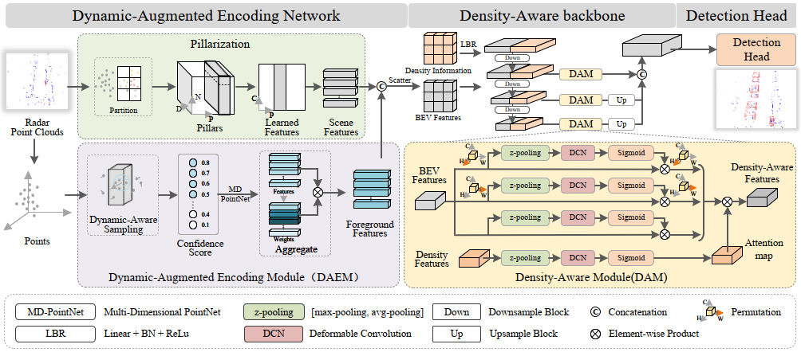

25. **SpikingRTNH: Spiking Neural Network for 4D Radar Object Detection (25'arXiv)**

    - **:link:Link:** [paper](https://arxiv.org/pdf/2502.00074)
    - **:school:Affiliation:** KAIST (Seung-Hyun Kong)
    - **:file_folder:Dataset:** K-Radar
    - **:book:Note:** 

    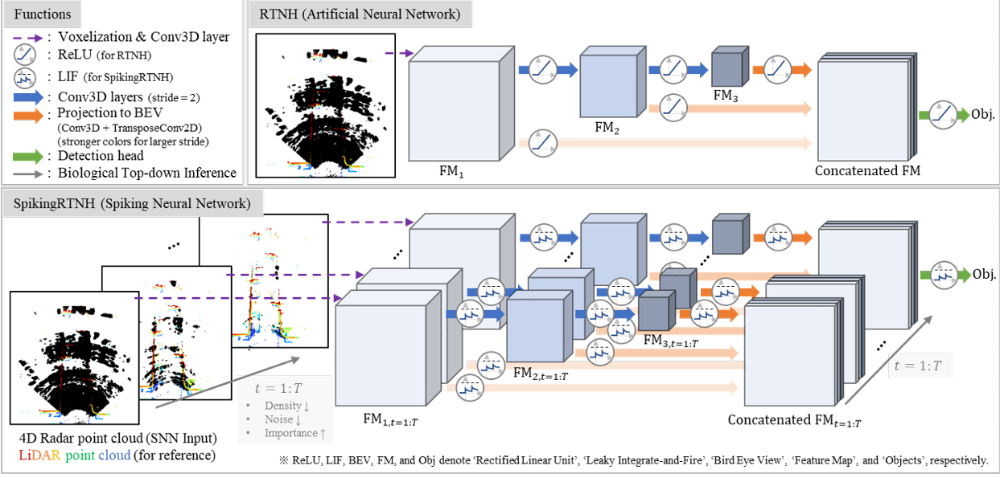
    
26. **MAFF-Net: Enhancing 3D Object Detection With 4D Radar Via Multi-Assist Feature Fusion (25'RA-L)**

    - **:link:Link:** [paper](https://ieeexplore.ieee.org/abstract/document/10923711)
    - **:school:Affiliation:** Tongji University (Xin Bi, Caien Weng)
    - **:file_folder:Dataset:** VoD, TJ4DRadSet
    - **:book:Note:** 

    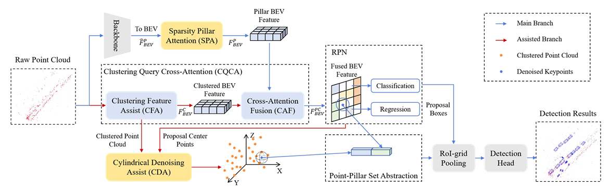
    
27. **AS-Det: Active Sampling for Adaptive 3D Object Detection in Point Clouds (25'AAAI)**

    - **:link:Link:** [paper](https://ojs.aaai.org/index.php/AAAI/article/view/32281/34436) [code(unfilled project)](https://github.com/eat-slim/AS-Det)
    - **:school:Affiliation:** Fudan University (Ziheng Ding)
    - **:file_folder:Dataset:** VoD, Self-collected Dataset
    - **:book:Note:** 
    
    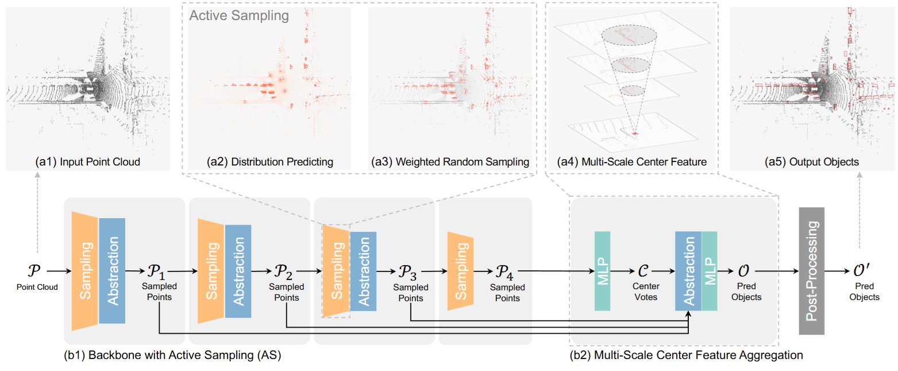

28. **Class-Aware PillarMix: Can Mixed Sample Data Augmentation Enhance 3D Object Detection with Radar Point Clouds? (25'IROS)**

    - **:link:Link:** [paper](https://arxiv.org/pdf/2503.02687)
    - **:school:Affiliation:** Robert Bosch GmbH (Miao Zhang)
    - **:file_folder:Dataset:** K-Radar, Bosch Street
    - **:book:Note:** 

    
    
29. **Radar M3-Net: Multi-scale, multi-layer, multi-frame network with a large receptive field for 3D object detection (25'Expert Systems with Applications)**

    - **:link:Link:** [paper](https://www.sciencedirect.com/science/article/pii/S0957417425011376)
    - **:school:Affiliation:**  University of Science and Technology of China (Yunting Yang, Jun Liu)
    - **:file_folder:Dataset:** VoD, TJ4DRadSet
    - **:book:Note:** 

    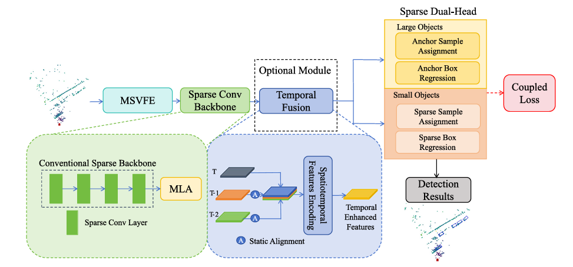

### Fusion of 4D Radar & LiDAR

1. **InterFusion: Interaction-based 4D Radar and LiDAR Fusion for 3D Object Detection (22'IROS)**
   - **:link:Link:** [paper](https://ieeexplore.ieee.org/abstract/document/9982123)
   - **:school:Affiliation:** Tsinghua University (Li Wang)
   - **:file_folder:Dataset:** Astyx
   - **:book:Note:** 
   
   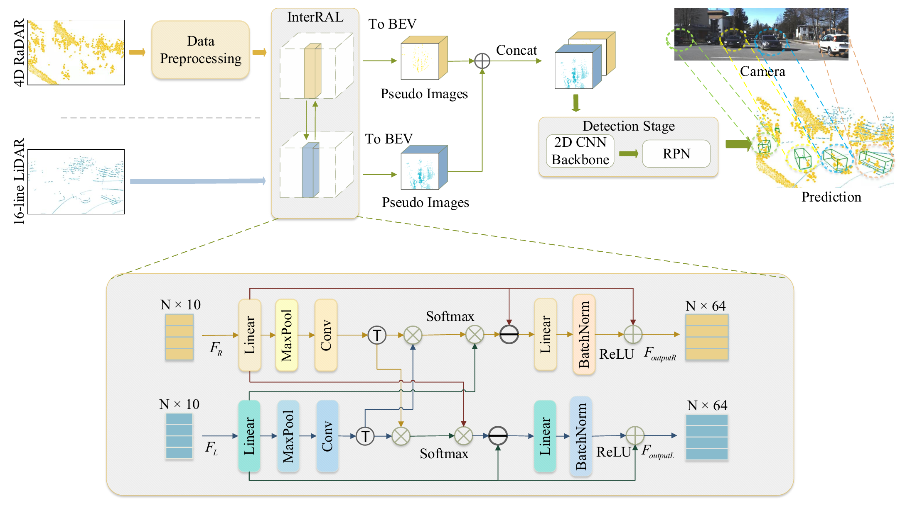
   
2. **Multi-Modal and Multi-Scale Fusion 3D Object Detection of 4D Radar and LiDAR for Autonomous Driving (23'TVT)** 
   - **:link:Link:** [paper](https://ieeexplore.ieee.org/abstract/document/9991894)
   - **:school:Affiliation:** Tsinghua University (Li Wang)
   - **:file_folder:Dataset:** Astyx
   - **:book:Note:** 
   
   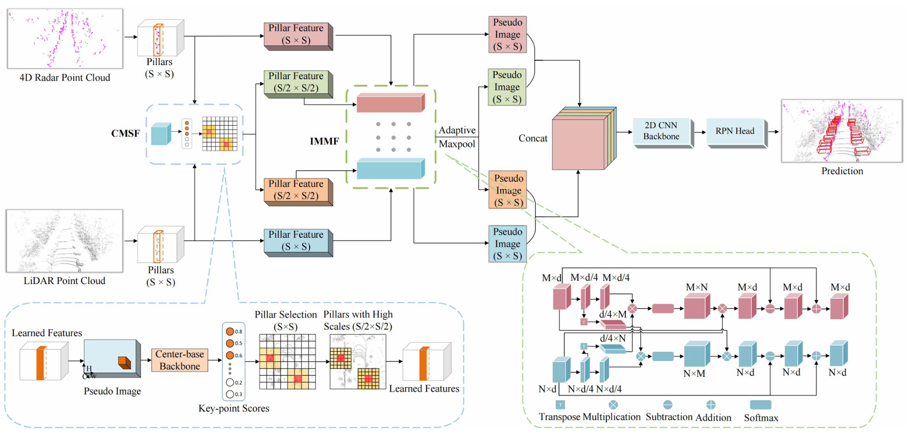
   
3. **L4DR: LiDAR-4DRadar Fusion for Weather-Robust 3D Object Detection (24'arXiv)**
   - **:link:Link:** [paper](https://arxiv.org/pdf/2408.03677)
   - **:school:Affiliation:** Xiamen University
   - **:file_folder:Dataset:** VoD, K-Radar
   - **:book:Note:** For the K-Radar dataset, we preprocess the 4D radar spar setensor by selecting only the top 10240 points with high power measurement. This paper is submitted to 25'AAAI. 
   
   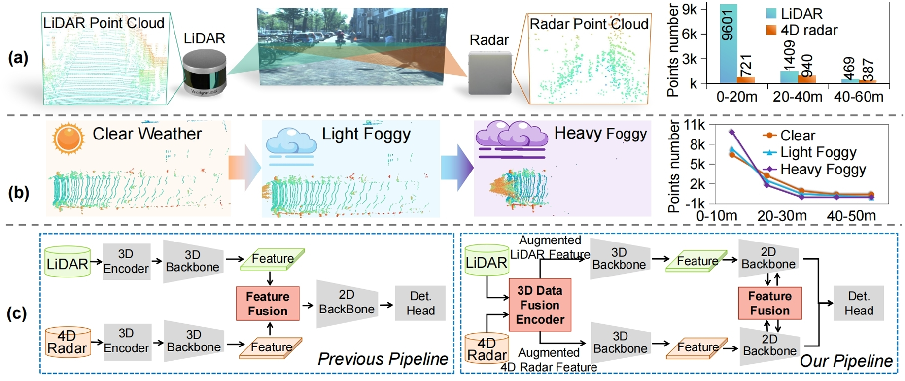
   
4. **Robust 3D Object Detection from LiDAR-Radar Point Clouds via Cross-Modal Feature Augmentation (24'ICRA)**
   - **:link:Link:** [paper](https://ieeexplore.ieee.org/abstract/document/10610775)  [code](https://github.com/DJNing/See_beyond_seeing)
   - **:school:Affiliation:** University of Edinburgh, University College London (Chris Xiaoxuan Lu)
   - **:file_folder:Dataset:** VoD
   - **:book:Note:** 
   
   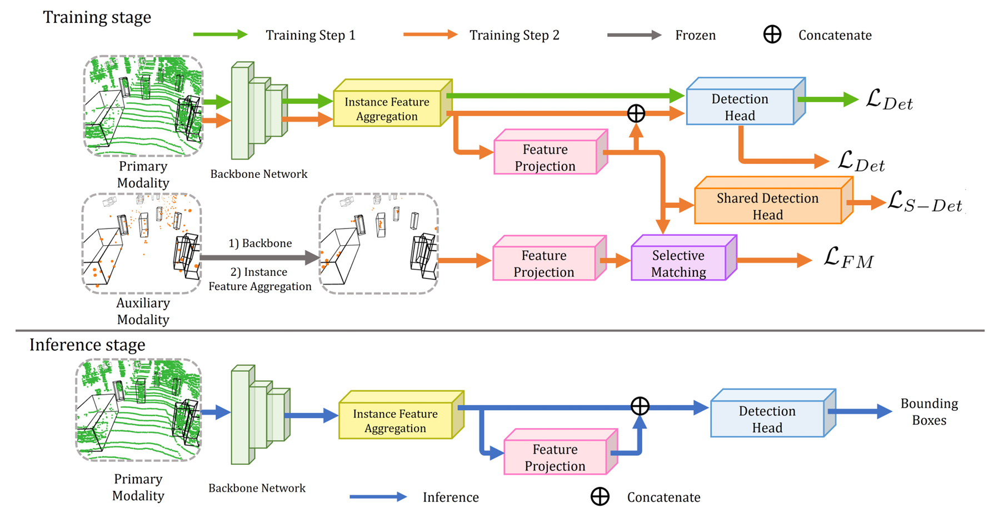
   
5. **Traffic Object Detection for Autonomous Driving Fusing LiDAR and Pseudo 4D-Radar Under Bird’s-Eye-View (24'TITS)**
   - **:link:Link:** [paper](https://ieeexplore.ieee.org/document/10571662)
   - **:school:Affiliation:** Xi’an Jiaotong University (Yonghong Song)
   - **:file_folder:Dataset:** Astyx
   - **:book:Note:** 
   
   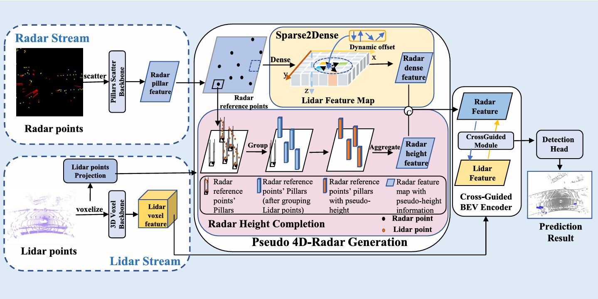
   
6. **Fusing LiDAR and Radar with Pillars Attention for 3D Object Detection (24'International Symposium on Autonomous Systems (ISAS))**
   - **:link:Link:** [paper](https://ieeexplore.ieee.org/document/10552581)
   - **:school:Affiliation:** Zhejiang University (Liang Liu)
   - **:file_folder:Dataset:** VoD
   - **:book:Note:** 
   
   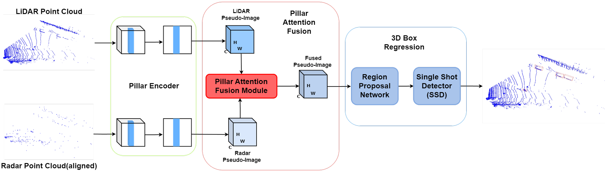
   
7. **RLNet: Adaptive Fusion of 4D Radar and Lidar for 3D Object Detection (24'ECCVW)**
   - **:link:Link:** [paper and reviews](https://openreview.net/forum?id=I5IIhtSbMe)
   - **:school:Affiliation:** Zhejiang University (Zhiyu Xiang)
   - **:file_folder:Dataset:** ZJUODset
   - **:book:Note:** 
   
   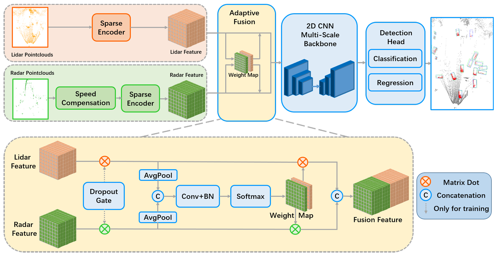
   
8. **LEROjD: Lidar Extended Radar-Only Object Detection (24'ECCV)**
   - **:link:Link:** [paper](https://arxiv.org/pdf/2409.05564) [code](https://github.com/rst-tu-dortmund/lerojd)
   - **:school:Affiliation:**  TU Dortmund University (Patrick Palmer, Martin Krüger)
   - **:file_folder:Dataset:** VoD
   - **:book:Note:** "Although lidar should not be used during inference, it can aid the training of radar-only object detectors." 
   
   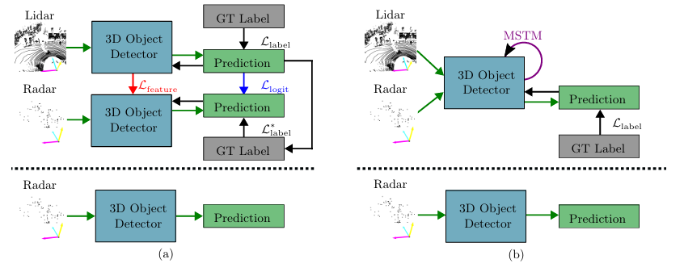
   
9. **V2X-R: Cooperative LiDAR-4D Radar Fusion for 3D Object Detection with Denoising Diffusion (25'CVPR)**
   
   - **:link:Link:** [paper](https://openaccess.thecvf.com/content/CVPR2025/papers/Huang_V2X-R_Cooperative_LiDAR-4D_Radar_Fusion_with_Denoising_Diffusion_for_3D_CVPR_2025_paper.pdf) [code](https://github.com/ylwhxht/V2X-R)
   - **:school:Affiliation:**  Xiamen University (Chenglu Wen)
   - **:file_folder:Dataset:** V2X-R
   - **:book:Note:** baseline method of V2X-R Datasets
   
   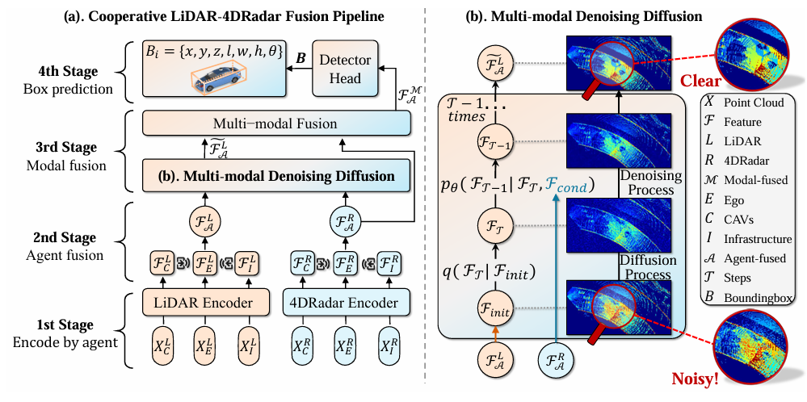
   
10. **MutualForce: Mutual-Aware Enhancement for 4D Radar-LiDAR 3D Object Detection (25'arXiv)**

    - **:link:Link:** [paper](https://arxiv.org/pdf/2501.10266) 
    - **:school:Affiliation:** Technical University of Munich (Xiangyuan Peng)
    - **:file_folder:Dataset:** VoD
    - **:book:Note:** 

    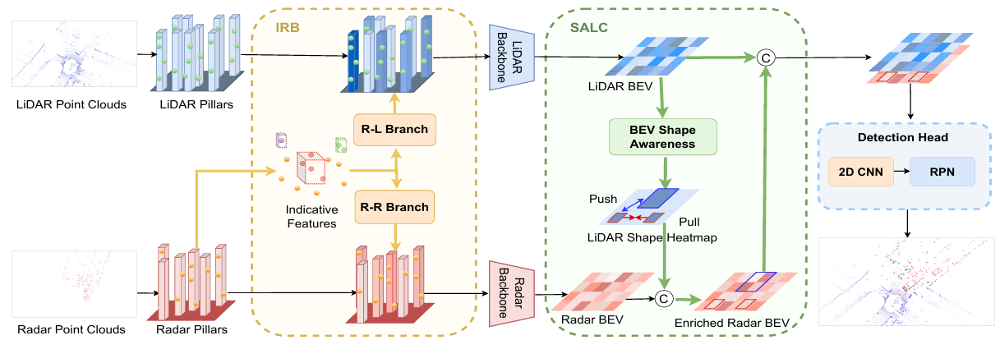

11. **BSM-NET: multi-bandwidth, multi-scale and multi-modal fusion network for 3D object detection of 4D radar and LiDAR (25'Measurement Science and Technology)**

    - **:link:Link:** [paper](https://iopscience.iop.org/article/10.1088/1361-6501/adafcb/meta)
    - **:school:Affiliation:** Anhui University (Runjie Kang)
    - **:file_folder:Dataset:** Dual-Radar
    - **:book:Note:** 

    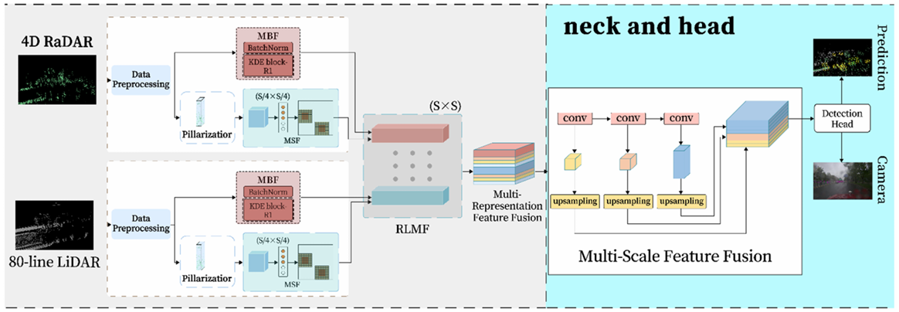
    
12. **A Novel Multi-Teacher Knowledge Distillation for Real-Time Object Detection using 4D Radar (25'arXiv)**

    - **:link:Link:** [paper](https://arxiv.org/pdf/2502.06114)
    - **:school:Affiliation:** KAIST (Seung-Hyun Kong)
    - **:file_folder:Dataset:** K-Radar
    - **:book:Note:** 

    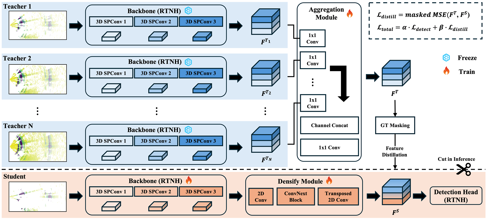
    
13. **MoRAL: Motion-aware Multi-Frame 4D Radar and LiDAR Fusion for Robust 3D Object Detection (25'arXiv)**

    - **:link:Link:** [paper](https://arxiv.org/pdf/2502.06114)
    - **:school:Affiliation:** Technical University of Munich (Xiangyuan Peng)
    - **:file_folder:Dataset:** VoD
    - **:book:Note:** 

    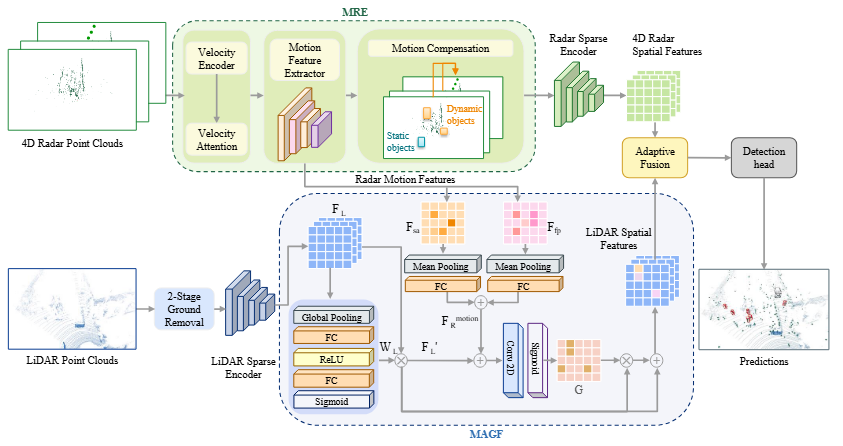

### Fusion of 4D Radar & RGB Camera

1. **RCFusion: Fusing 4-D Radar and Camera With Bird’s-Eye View Features for 3-D Object Detection (23'TIM)**
   - **:link:Link:** [paper](https://arxiv.org/pdf/2505.09422)
   - **:school:Affiliation:** Tongji University (Zhixiong Ma)
   - **:file_folder:Dataset:** VoD, TJ4DRadSet
   - **:book:Note:** 
   
   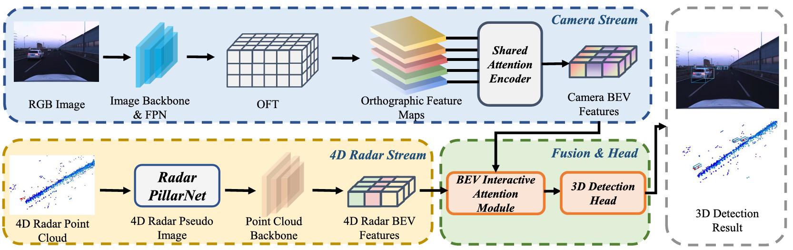
   
2. **GRC-Net: Fusing GAT-Based 4D Radar and Camera for 3D Object Detection (23'SAE Technical Paper)**
   - **:link:Link:** [paper](https://www.sae.org/publications/technical-papers/content/2023-01-7088/)
   - **:school:Affiliation:** Beijing Institute of Technology (Lili Fan)
   - **:file_folder:Dataset:** VoD
   - **:book:Note:** 
   
   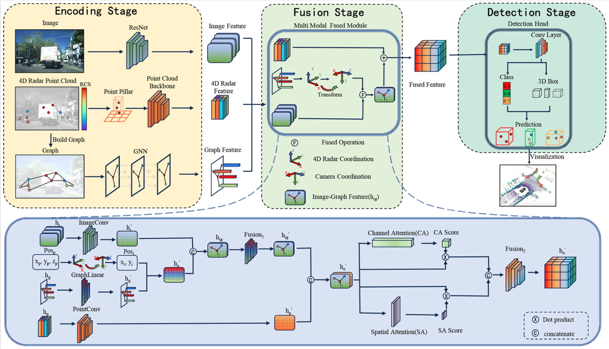
   
3. **LXL: LiDAR Excluded Lean 3D Object DetectionWith 4D Imaging Radar and Camera Fusion (24'TIV)**
   
   - **:link:Link:** [paper](https://ieeexplore.ieee.org/abstract/document/10268601)
   - **:school:Affiliation:** Beihang University (Bing Zhu)
   - **:file_folder:Dataset:** VoD, TJ4DRadSet
   - **:book:Note:** 
   
   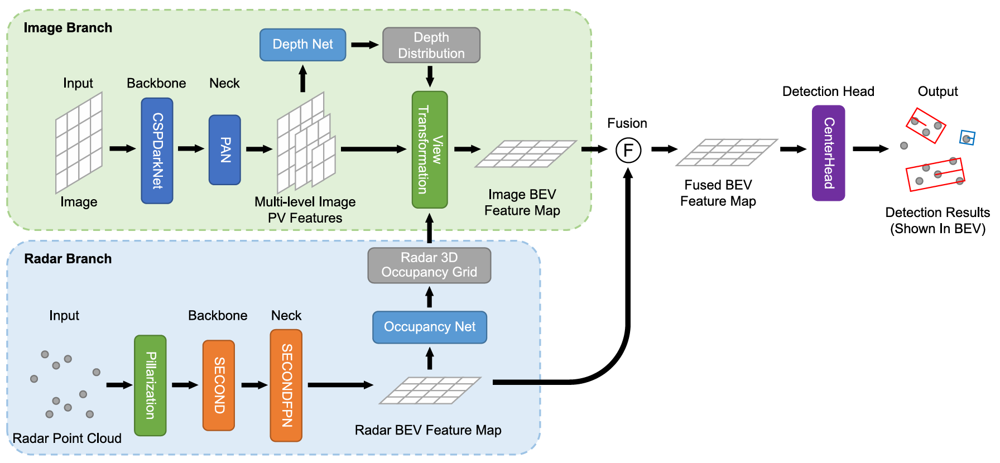
   
4. **TL-4DRCF: A Two-Level 4-D Radar–Camera Fusion Method for Object Detection in Adverse Weather (24'IEEE Sensors Journal)**
   - **:link:Link:** [paper](https://ieeexplore.ieee.org/document/10491101) 
   - **:school:Affiliation:** South China University of Technology (Kai Wu)
   - **:file_folder:Dataset:** VoD
   - **:book:Note:** Beyond the VoD, the LiDAR point cloud and images of the VoD dataset are processed with artificial fog to obtain the VoD-Fog dataset for validating our model. 
   
   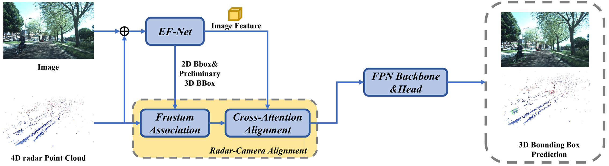
   
5. **UniBEVFusion: Unified Radar-Vision BEVFusion for 3D Object Detection (24'arXiv)**
   - **:link:Link:** [paper](https://arxiv.org/abs/2409.14751)
   - **:school:Affiliation:** Xi'an Jiaotong - Liverpool University
   - **:file_folder:Dataset:** VoD, TJ4DRadSet
   - **:book:Note:** 
   
   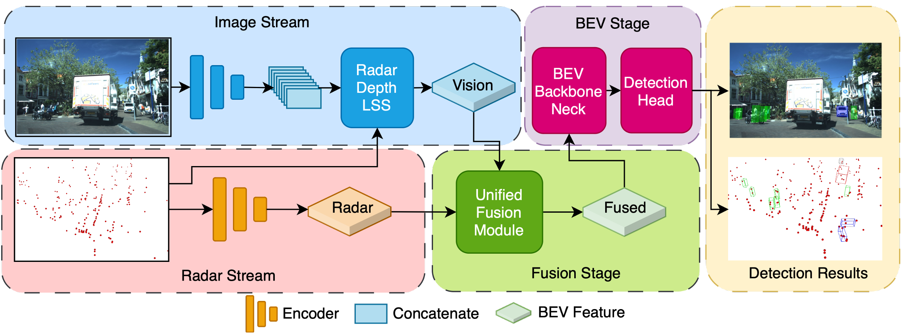
   
6. **RCBEVDet: Radar-camera Fusion in Bird’s Eye View for 3D Object Detection (24'CVPR)**
   - **:link:Link:** [paper](https://openaccess.thecvf.com/content/CVPR2024/papers/Lin_RCBEVDet_Radar-camera_Fusion_in_Birds_Eye_View_for_3D_Object_CVPR_2024_paper.pdf) 
   - **:school:Affiliation:** Peking University (Yongtao Wang)
   - **:file_folder:Dataset:** VoD
   - **:book:Note:** not only 4D mmWave Radar, but 3D Radar like Nuscenes
   
   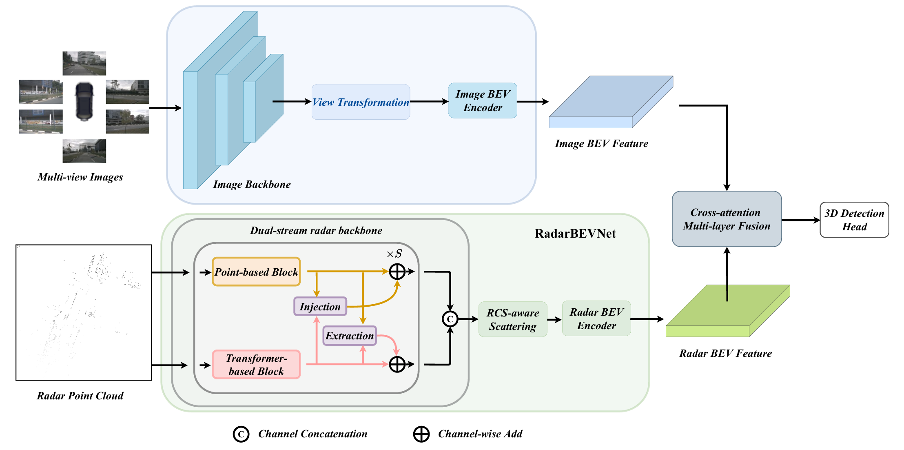
   
7. **MSSF: A 4D Radar and Camera Fusion Framework With Multi-Stage Sampling for 3D Object Detection in Autonomous Driving (24'arXiv)**
   - **:link:Link:** [paper](https://arxiv.org/pdf/2411.15016)
   - **:school:Affiliation:** University of Science andTechnology of China (Jun Liu)
   - **:file_folder:Dataset:** VoD, TJ4DRadset
   - **:book:Note:** 
   
   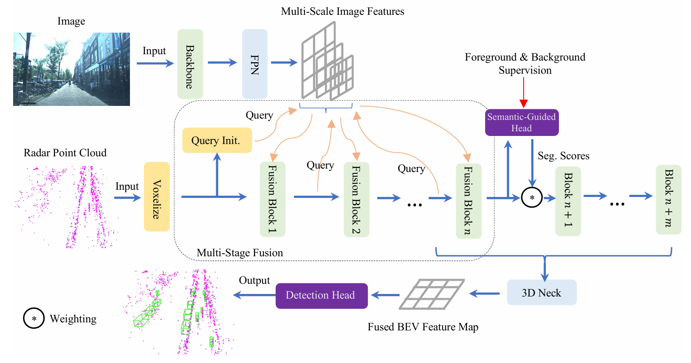
   
8. **SGDet3D: Semantics and Geometry Fusion for 3D Object Detection Using 4D Radar and Camera (24'RA-L)**
   - **:link:Link:** [paper](https://ieeexplore.ieee.org/abstract/document/10783046) [code](https://github.com/shawnnnkb/SGDet3D)
   - **:school:Affiliation:** Zhejiang University (Huiliang Shen)
   - **:file_folder:Dataset:** VoD, TJ4DRadset
   - **:book:Note:** 
   
   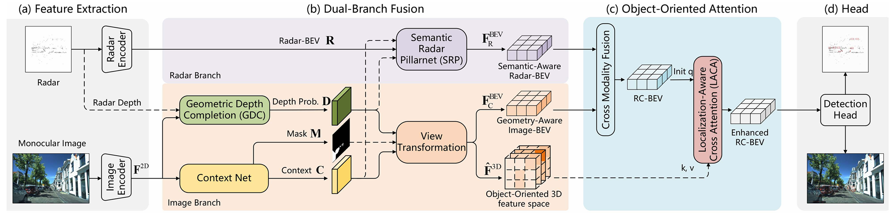
   
9. **ERC-Fusion: Fusing Enhanced 4D Radar and Camera for 3D Object Detection (24'DTPI)**
   - **:link:Link:** [paper](https://ieeexplore.ieee.org/abstract/document/10778707/)
   - **:school:Affiliation:** Beijing Institute of Technology (Lili Fan)
   - **:file_folder:Dataset:** VoD
   - **:book:Note:** 
   
   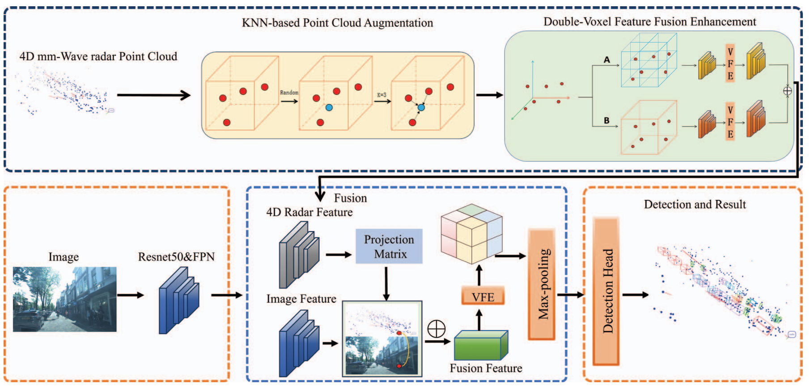
   
10. **HGSFusion: Radar-Camera Fusion with Hybrid Generation and Synchronization for 3D Object Detection (25'AAAI)**
    - **:link:Link:** [paper](https://arxiv.org/pdf/2412.11489) [code](https://github.com/garfield-cpp/HGSFusion)
    - **:school:Affiliation:** Southeast University (Yan Huang)
    - **:file_folder:Dataset:** VoD, TJ4DRadSet
    - **:book:Note:** 
    
    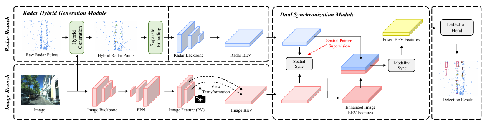
    
11. **C4RFNet: Camera and 4D-Radar Fusion Network for Point Cloud Enhancement (24'IEEE Sensors Journal)**
    
    - **:link:Link:** [paper](https://ieeexplore.ieee.org/abstract/document/10824694)
    - **:school:Affiliation:** Nanjing University of Science and Technology (Weibin Zhang)
    - **:file_folder:Dataset:** VoD
    - **:book:Note:** 
    
    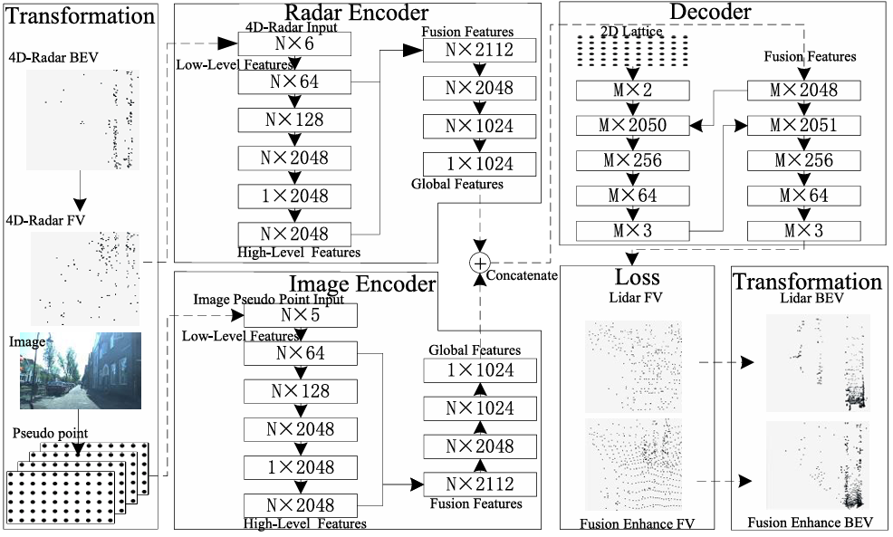
    
12. **Doracamom: Joint 3D Detection and Occupancy Prediction with Multi-view 4D Radars and Cameras for Omnidirectional Perception (25'arXiv)**

    - **:link:Link:** [paper](https://arxiv.org/pdf/2501.1534)
    - **:school:Affiliation:** Tongji University (Zhixiong Ma)
    - **:file_folder:Dataset:** OmniHD-Scenes, VoD, TJ4DRadSet
    - **:book:Note:** 

    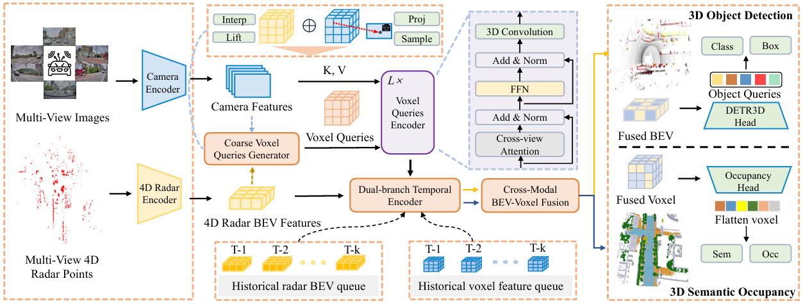
    
13. **LXLv2: Enhanced LiDAR Excluded Lean 3D Object Detection with Fusion of 4D Radar and Camera (25'RA-L)**

    - **:link:Link:** [paper](https://ieeexplore.ieee.org/abstract/document/10858389)
    - **:school:Affiliation:** Beihang University (Bing Zhu)
    - **:file_folder:Dataset:** VoD, TJ4DRadSet
    - **:book:Note:** 

    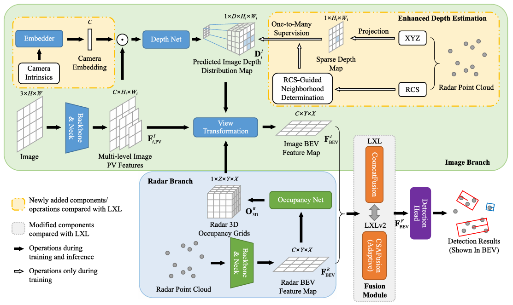
    
14. **Depth-aware Fusion Method based on Image and 4D Radar Spectrum for 3D Object Detection (24'IEEE ROBIO)**

    - **:link:Link:** [paper](https://arxiv.org/pdf/2502.15516)
    - **:school:Affiliation:** Shanghai Jiao Tong University (Yeqiang Qian)
    - **:file_folder:Dataset:** K-Radar
    - **:book:Note:** Radar Tensor and Camera Image

    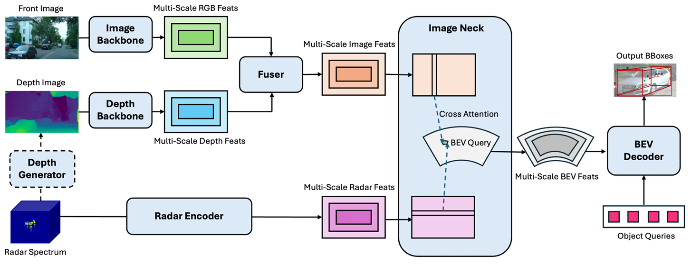
    
15. **RaCFormer: Towards High-Quality 3D Object Detection via Query-based Radar-Camera Fusion (25'CVPR)**

    - **:link:Link:** [paper](https://arxiv.org/pdf/2412.12725)
    - **:school:Affiliation:** University of Science and Technology of China (Xiaomeng Chu, Yanyong Zhang*)
    - **:file_folder:Dataset:** VoD
    - **:book:Note:** also conduct experiments with NuScenes dataset (3D Radar)

    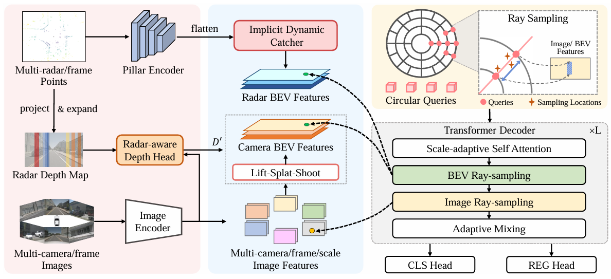
    
16. **ZFusion: An Effective Fuser of Camera and 4D Radar for 3D Object Perception in Autonomous Driving (25'CVPRW)**

    - **:link:Link:** [paper](https://arxiv.org/pdf/2504.03438)
    - **:school:Affiliation:** Fudan University (Jian Wang)
    - **:file_folder:Dataset:** VoD
    - **:book:Note:** 

    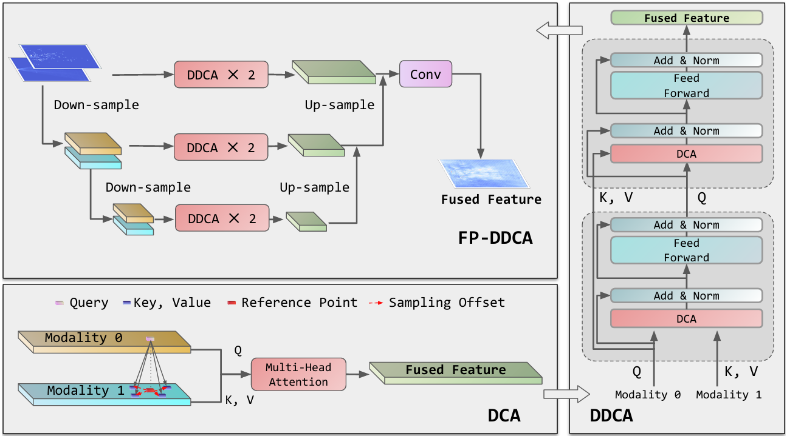
    
17. **Dual-sampling feature fusion for three-dimensional object detection using four-dimensional radar and camera (2025'EAAI)**

    - **:link:Link:** [paper](https://www.sciencedirect.com/science/article/pii/S095219762500747X)
    - **:school:Affiliation:** Tongji University (Xin Bi, Caien Weng)
    - **:file_folder:Dataset:** VoD, TJ4DRadSet
    - **:book:Note:** 

    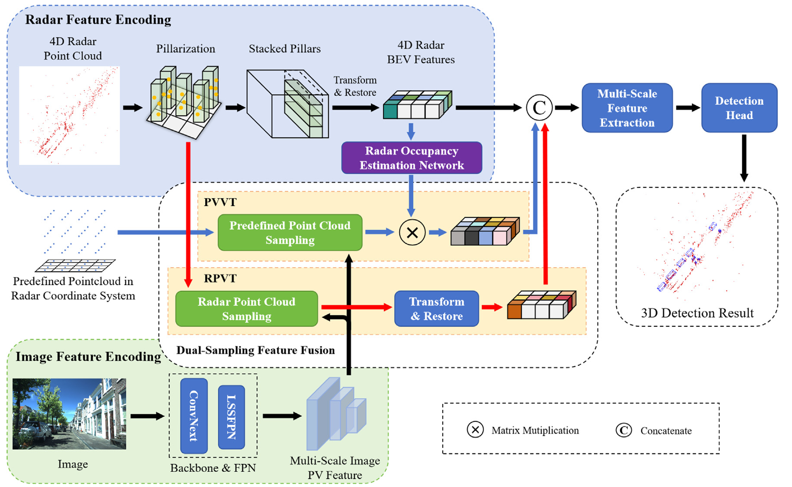
    
18. **RCDFNet: A 4-D Radar and Camera Dual-Level Fusion Network for 3D Object Detection (25'IEEE Sensors Journal)**

    - **:link:Link:** [paper](https://ieeexplore.ieee.org/abstract/document/11006930) [code (unfilled project)](https://github.com/D-Hourse/RCDFNet/tree/master)
    - **:school:Affiliation:** Sun Yat-sen University (PeifengCheng)
    - **:file_folder:Dataset:** VoD, TJ4DRadSet
    - **:book:Note:** 

    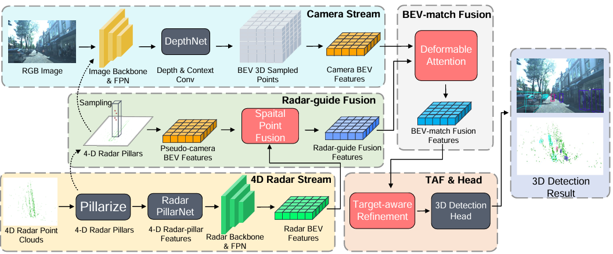
    
19. **CVFusion: Cross-View Fusion of 4D Radar and Camera for 3D Object Detection (25'arXiv)**

    - **:link:Link:** [paper](https://arxiv.org/html/2507.04587v1) [code (unfilled project)](https://github.com/zhzhzhzhzhz/CVFusion)
    - **:school:Affiliation:** Zhejiang University (Zhiyu Xiang)
    - **:file_folder:Dataset:** VoD, TJ4DRadSet
    - **:book:Note:** 

    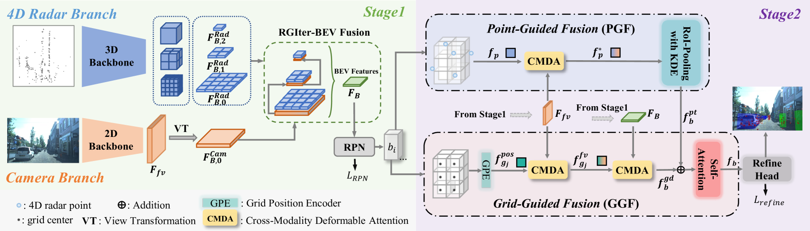

### Others

1. **LiDAR-based All-weather 3D Object Detection via Prompting and Distilling 4D Radar (24'ECCV)**
   - **:link:Link:** [paper](https://www.ecva.net/papers/eccv_2024/papers_ECCV/papers/07349.pdf) [code (unfilled project)](https://github.com/yujeong-star/LOD_PDR)
   - **:school:Affiliation:** KAIST (Yujeong Chae)
   - **:file_folder:Dataset:** K-Radar
   - **:book:Note:** 

   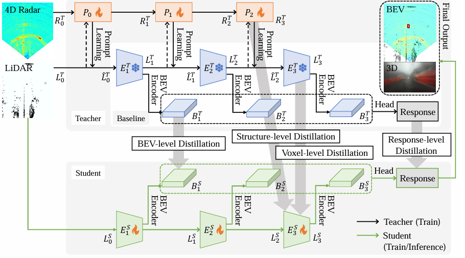
   
2. **Exploring Domain Shift on Radar-Based 3D Object Detection Amidst Diverse Environmental Conditions (24'ITSC)**
   - **:link:Link:** [paper](https://arxiv.org/pdf/2408.06772)
   - **:school:Affiliation:** Robert Bosch GmbH (Miao Zhang)
   - **:file_folder:Dataset:** K-Radar, Bosch-Radar
   - **:book:Note:** 
   
   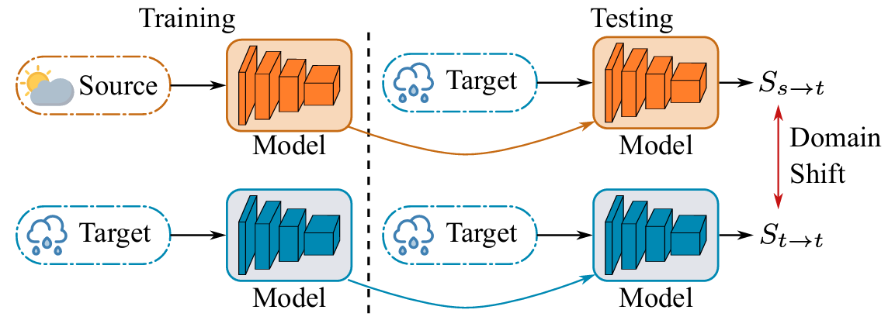

## Survey Papers

1. **4D Millimeter-Wave Radar in Autonomous Driving: A Survey (23'arXiv)**
   -  **:link:Link:** [paper](https://arxiv.org/pdf/2306.04242)
   -  **:school:Affiliation:** Tsinghua University (Jianqiang Wang)
   
2. **4D mmWave Radar for Autonomous Driving Perception: A Comprehensive Survey (24'TIV)**
   -  **:link:Link:** [paper](https://ieeexplore.ieee.org/abstract/document/10477463) 
   -  **:school:Affiliation:** Beijing Institute of Technology (Lili Fan)
   
3. **A Survey of Deep Learning Based Radar and Vision Fusion for 3D Object Detection in Autonomous Driving (24'arXiv)**

   -  **:link:Link:** [paper](https://arxiv.org/pdf/2406.00714)
   -  **:school:Affiliation:** Northwestern Polytechnical University (Feng Yang)
   
   

## Basic Knowledge

### What is 3D Object Detection with 4D Radar?

3D object detection is able to obtain the position, size and orientation information of objects in 3D space, and is widely used in automatic driving perception, robot manipulation, and other applications. In 3D object detection, sensors such as LiDAR, RGB camera and depth camera are commonly used. In recent years, several works have been proposed to utilize 4D radar as a primary or secondary sensor to achieve 3D object detection. 4D radar, also known as 4D millimeter wave (mmWave) radar or 4D imaging radar. Compared to 3D radar, 4D radar not only obtains the distance, direction and relative velocity (Doppler velocity) of the target object, but also detects the height of the object. Due to its robustness against different weather conditions and lower cost, 4D radar is expected to replace low beam LiDAR in the future. This repo summarizes the 4D radar based 3D object detection methods and datasets. 

### Different 4D Radar Data Representations

- **PC:** **P**oint **C**loud
- **ADC:** **A**nalog-to-**D**igital **C**onverter signal
- **RT:** **R**adar **T**ensor (include **R**ange-**A**zimuth-**D**oppler Tensor, **R**ange-**A**zimuth Tensor, **R**ange-Doppler Tensor)

### Other Materials

## Representative researchers

- [**Li Wang**](https://scholar.google.com/citations?hl=zh-CN&user=kLTnwAsAAAAJ&view_op=list_works&sortby=pubdate) (Postdoctoral Fellow) and his co-leader **Xinyu Zhang** @Tsinghua University, authors of Dual Radar
- [**Bing Zhu**](https://shi.buaa.edu.cn/zhubing/zh_CN/index.htm) @Beihang University
- [**Lin Yang**](https://me.sjtu.edu.cn/teacher_directory1/2080.html) @Shanghai Jiao Tong University
- [**Chris Xiaoxuan Lu**](https://christopherlu.github.io) @University College London (UCL)
- [**Zhixiong Ma**](https://ieeexplore.ieee.org/author/37085837925) @Tongji University, the author of TJ4DRadSet Dataset and OmniHD-Scenes Dataset
- [**Zhiyu Xiang**](https://mypage.zju.edu.cn/xiangzy#569131) @Zhejiang University, the author of ZJUODset Dataset
- [**Yujeong Chae**](https://scholar.google.com/citations?user=2dP6JlQAAAAJ) and his PhD Advisor [**Kuk-Jin Yoon**](https://scholar.google.com/citations?user=1NvBj_gAAAAJ) @Korea Advanced Institute of Science and Technology (KAIST)
- [**Lili Fan**](https://ac.bit.edu.cn/szdw/jsml/mssbyznxtyjs1/6711569f697a43c08be59ba673ecf2bd.htm) @Beijing Institute of Technology
- [**Chenglu Wen**](https://asc.xmu.edu.cn/t/wenchenglu) @Xiamen university, the author of CMD Dataset and V2X-R Dataset
- [**Seung-Hyun Kong**](https://mo.kaist.ac.kr/en/professor/gong-seung-hyun/) @Korea Advanced Institute of Science and Technology (KAIST), the author of K-Radar Dataset

## Star History

